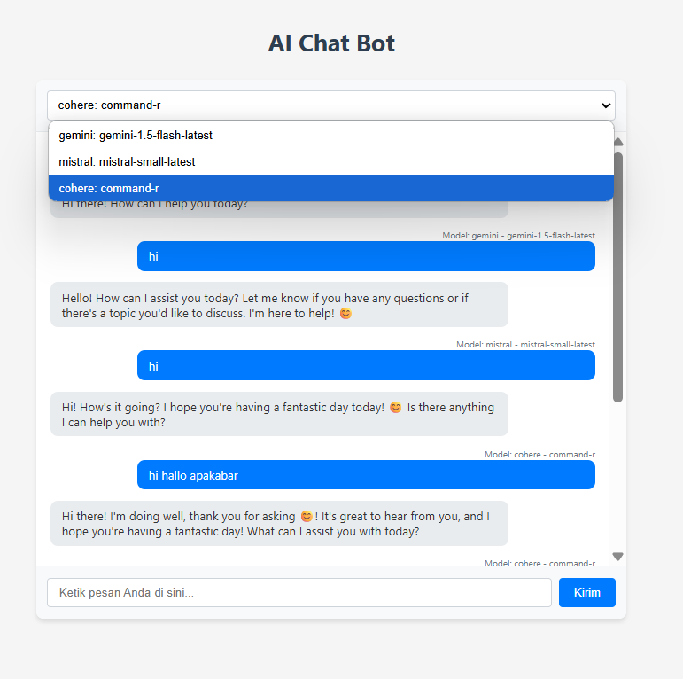

          
# README - AI Chat Bot

## Deskripsi
Aplikasi AI Chat Bot ini memungkinkan pengguna untuk berinteraksi dengan berbagai model AI seperti Gemini, Mistral, dan Cohere melalui antarmuka chat yang sederhana dan responsif.



## Cara Mendapatkan API Key

### Gemini API
1. Kunjungi [Google AI Studio](https://makersuite.google.com/app/apikey)
2. Buat akun Google jika belum memilikinya
3. Buat API key baru
4. Salin API key dan simpan di file `.env` sebagai `GEMINI_API_KEY`

### Mistral API
1. Kunjungi [Mistral AI Platform](https://console.mistral.ai/)
2. Daftar untuk mendapatkan akun
3. Buat API key baru di dashboard
4. Salin API key dan simpan di file `.env` sebagai `MISTRAL_API_KEY`

### Cohere API
1. Kunjungi [Cohere Dashboard](https://dashboard.cohere.com/)
2. Buat akun baru
3. Navigasi ke bagian API Keys
4. Buat API key baru
5. Salin API key dan simpan di file `.env` sebagai `COHERE_API_KEY`

## Struktur Kode

### Struktur Folder
```
non-openrouter/
├── app.py                 # File utama aplikasi Flask
├── handlers/              # Handler untuk berbagai model AI
│   ├── gemini_handler.py  # Handler untuk Gemini API
│   ├── mistral_handler.py # Handler untuk Mistral API
│   └── cohere_handler.py  # Handler untuk Cohere API
├── templates/             # Template HTML
│   └── index.html         # Halaman utama aplikasi
└── .env                   # File untuk menyimpan API key (tidak di-commit)
```

### Penjelasan Komponen Utama

#### app.py
File utama yang menjalankan server Flask dan menangani routing. Ini mengatur:
- Konfigurasi model yang tersedia
- Endpoint API untuk chat
- Caching respons untuk performa yang lebih baik
- Rendering template HTML

#### handlers/
Folder ini berisi modul Python terpisah untuk setiap penyedia AI:
- `gemini_handler.py`: Menangani permintaan ke Gemini API
- `mistral_handler.py`: Menangani permintaan ke Mistral API
- `cohere_handler.py`: Menangani permintaan ke Cohere API

Setiap handler memiliki fungsi untuk memanggil API yang sesuai dan memformat respons.

#### templates/index.html
Template HTML untuk antarmuka pengguna. Ini mencakup:
- Pemilih model
- Area chat
- Input pesan
- JavaScript untuk interaksi tanpa reload halaman

## Penjelasan tentang __pycache__

Folder `__pycache__` adalah folder yang dibuat secara otomatis oleh Python saat modul diimpor. Fungsinya adalah:

1. **Menyimpan Bytecode**: Python mengkompilasi file `.py` menjadi bytecode (file `.pyc`) untuk meningkatkan kecepatan loading modul pada eksekusi berikutnya.

2. **Meningkatkan Performa**: Dengan menyimpan bytecode, Python tidak perlu mengkompilasi ulang modul setiap kali dijalankan, sehingga aplikasi berjalan lebih cepat.

3. **Versi-Spesifik**: Nama file bytecode biasanya menyertakan versi Python yang digunakan (misalnya `module.cpython-39.pyc`), sehingga Python dapat mendeteksi perubahan versi.

4. **Otomatis Diperbarui**: Jika file sumber `.py` diubah, Python akan secara otomatis mengkompilasi ulang dan memperbarui file bytecode.

Folder `__pycache__` tidak perlu dimasukkan ke dalam version control (seperti Git) dan biasanya ditambahkan ke `.gitignore`.

## Cara Menjalankan Aplikasi

1. Pastikan Python dan pip sudah terinstal
2. Instal dependensi:
   ```bash
   pip install flask requests python-dotenv
   ```
3. Buat file `.env` dan tambahkan API key:
   ```
   GEMINI_API_KEY=your_gemini_api_key
   MISTRAL_API_KEY=your_mistral_api_key
   COHERE_API_KEY=your_cohere_api_key
   ```
4. Jalankan aplikasi:
   ```bash
   python app.py
   ```
5. Buka browser dan akses `http://localhost:5000`

## Fitur
- Pilihan berbagai model AI (Gemini, Mistral, Cohere)
- Antarmuka chat yang responsif
- Indikator "AI sedang mengetik..."
- Caching respons untuk performa yang lebih baik

        